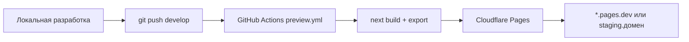
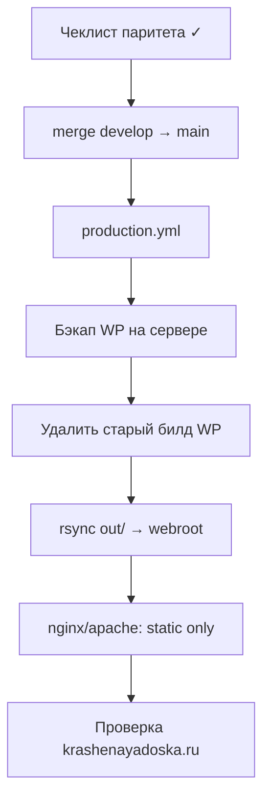

# План рефакторинга krashenayadoska.ru → Next.js

**Цель:** заменить WordPress + Elementor на статический/SSG-сайт на React/Next.js без потери SEO, URL и визуала.  
**Стратегия деплоя:** сначала превью на **Cloudflare Pages** (push в GitHub), после паритета — **продакшен на основном сервере** через GitHub Actions с удалением старого WP-билда.

**Источники:** `docs/SITE-INVENTORY.md`, `extracted/` (медиа, CMS JSON).

---

## 1. Принципы

| Принцип | Решение |
|---------|---------|
| SEO | Сохранить **текущие slug** (`/katalog/`, `/uslugi/`, …), не менять без 301 |
| Контент | Git-based JSON/MDX (миграция из WXR + ACF), без headless WP |
| Вёрстка | React-компоненты по Figma + расхождения из инвентаризации (палитра, технология) |
| Рендер | **SSG** (`output: 'export'`) — максимальная совместимость с CF Pages и nginx |
| CMS для редакторов | Этап 2+: Decap CMS / Tina / ручной JSON в репо (на старте — контент в `content/`) |
| Аналитика | Яндекс.Метрика, GA (Site Kit), cookie-баннер |
| Формы | Cloudflare Workers / Formspree / email API на этапе staging; тот же endpoint на проде |

---

## 2. Технологический стек

```
Next.js 15 (App Router) + TypeScript
Tailwind CSS + shadcn/ui (или собственные компоненты по Figma)
Manrope (шрифт с текущего сайта)
next/image → статика в public/ или Cloudflare Images (опционально)
Zod — валидация контент-схем
```

**Почему static export, а не SSR на CF:** каталог маркетинговый, обновления редкие; проще деплой на CF Pages и на обычный Linux-хостинг без Node в рантайме.

---

## 3. Структура репозитория

```
krashenayadoska/
├── .github/
│   └── workflows/
│       ├── preview.yml          # Cloudflare Pages (ветка develop / PR)
│       └── production.yml       # SSH/rsync на основной сервер (ветка main)
├── app/                         # Next.js App Router
│   ├── layout.tsx
│   ├── page.tsx                 # /
│   ├── katalog/
│   ├── uslugi/
│   ├── palitra/
│   ├── blog/
│   ├── project/                 # CPT project → /project/[slug] (как сейчас)
│   ├── o-kompanii/
│   ├── kontakty/
│   ├── tehnologija-nanesenija-kraski/
│   └── politika-konfidencialnosti/
├── components/                  # UI из Figma
├── content/                     # JSON/MDX после миграции
│   ├── pages/
│   ├── catalog/
│   ├── projects/
│   ├── blog/
│   └── settings.json            # телефоны, реквизиты, Marquiz ID
├── public/
│   └── uploads/                 # медиа из extracted/uploads (без .tar.gz)
├── lib/                         # парсеры, типы, metadata
├── scripts/                     # миграция WXR → content/
├── next.config.ts               # output: 'export', trailingSlash: true
└── docs/
```

**URL:** оставляем кириллические slug как на WP (`trailingSlash: true` для совпадения с `/katalog/`).

---

## 4. Модель контента (из ACF/WXR)

| Тип | Файл | Поля (из ACF) |
|-----|------|----------------|
| `ProductCategory` | `content/catalog/categories/*.json` | title, slug, parent, image, seo |
| `Product` | `content/catalog/products/*.json` | title, slug, category, gallery |
| `Project` | `content/projects/*.json` | hero, images, logos, slider, descr |
| `BlogPost` | `content/blog/*.json` | header, img, gallery, video, body |
| `Page` | `content/pages/*.json` | blocks[] или mdx |
| `SiteSettings` | `content/settings.json` | контакты, ИНН, соцсети, интеграции |

**Скрипты миграции (уже есть база):**
1. `extracted/cms-json/acf-export.json` → типы полей + значения
2. `krashenayadoskaru.WordPress.2026-06-18.xml` → страницы, посты, меню
3. `extracted/uploads/` → `public/uploads/` (пути `/wp-content/uploads/` → `/uploads/` + 301 при необходимости)

---

## 5. Этапы разработки

### Фаза 0 — Подготовка (1–2 недели)

- [x] Создать GitHub-репозиторий `krashenayadoska` (monorepo сайта) — scaffold в `site/`
- [x] Инициализировать Next.js + Tailwind + ESLint
- [x] Настроить `next.config.ts`: `output: 'export'`, `trailingSlash: true`, `images: { unoptimized: true }`
- [x] Скрипт `scripts/migrate-content.ps1` / `migrate-content.mjs` → `content/`
- [x] Перенести медиа: `extracted/uploads` → `public/uploads` (скрипт `sync-uploads.ps1`, 1643 файла)
- [ ] Design tokens из Figma: цвета, типографика, отступы
- [x] Базовые layout: `Header`, `Footer`

### Фаза 1 — Каркас и главная (2 недели)

- [x] Главная `/` — базовые секции (hero, преимущества, каталог, услуги, цвета, CTA)
- [x] Header/Footer
- [ ] Компоненты: полный паритет с продакшеном
- [ ] Подключить Метрику + cookie-notice
- [ ] **Деплой на Cloudflare Pages** (workflow готов, нужны секреты + push в `develop`)

### Фаза 2 — Каталог и услуги (2 недели)

- [x] `/katalog/` + категории (список и slug-страницы из JSON)
- [ ] `/katalog/` — карточки товаров
- [ ] `/uslugi/` + дочерние (`pokraska-dereva-na-stanke-metodom-raspyleni`)
- [ ] Шаблоны из Elementor: `arhiv-kategorij-tovarov`, `single-zapisi` — переверстать, не парсить Elementor JSON

### Фаза 3 — Контентные разделы (2 недели)

- [ ] `/palitra/` + RAL / NCS / BIOFA
- [ ] `/tehnologija-nanesenija-kraski/` (видео, FAQ)
- [ ] `/o-kompanii/`, `/kontakty/`, `/politika-konfidencialnosti/`
- [ ] Формы: callback + контакты (endpoint)

### Фаза 4 — Блог и проекты (1–2 недели)

- [x] `/blog/` + `blog-post` (16 статей, JSON + HTML body)
- [x] `/project/[slug]/` (10 проектов, JSON)
- [ ] Теги `news-tag`, таксономии проектов

### Фаза 5 — Паритет и SEO (1 неделя)

- [ ] Чеклист паритета (§7)
- [ ] `sitemap.xml`, `robots.txt`, canonical, Open Graph
- [ ] 301-маппинг только для реально изменённых URL (если будут)
- [ ] Lighthouse, мобильная вёрстка, доступность

### Фаза 6 — Продакшен-переключение (§8)

---

## 6. Этап A: Cloudflare Pages (staging)



### 6.1 Настройка Cloudflare

1. Cloudflare Dashboard → **Workers & Pages** → Create → Connect to Git → GitHub repo
2. **Build command:** `npm run build`
3. **Build output directory:** `out`
4. **Environment:** Node 20
5. Preview: `develop` или все PR → `*.pages.dev`
6. Опционально: custom domain `staging.krashenayadoska.ru` (CNAME на Pages)

### 6.2 GitHub Actions — `preview.yml`

```yaml
name: Preview (Cloudflare Pages)
on:
  push:
    branches: [develop]
  pull_request:
    branches: [main]

jobs:
  build:
    runs-on: ubuntu-latest
    steps:
      - uses: actions/checkout@v4
      - uses: actions/setup-node@v4
        with: { node-version: '20', cache: 'npm' }
      - run: npm ci
      - run: npm run build
      - uses: cloudflare/wrangler-action@v3
        with:
          apiToken: ${{ secrets.CLOUDFLARE_API_TOKEN }}
          accountId: ${{ secrets.CLOUDFLARE_ACCOUNT_ID }}
          command: pages deploy out --project-name=krashenayadoska
```

**Секреты:** `CLOUDFLARE_API_TOKEN`, `CLOUDFLARE_ACCOUNT_ID`.

### 6.3 Ветвление

| Ветка | Куда деплоится |
|-------|----------------|
| `develop` | Cloudflare Pages (авто) |
| `main` | Только продакшен (после паритета) |

---

## 7. Чеклист паритета (готовность к продакшену)

Перед переключением `production.yml` на основной сервер:

**Страницы (все опубликованные URL из WP):**
- [ ] `/`, `/uslugi/`, `/o-kompanii/`, `/blog/`, `/kontakty/`, `/katalog/`, `/palitra/`
- [ ] `/tehnologija-nanesenija-kraski/`, `/politika-konfidencialnosti/`
- [ ] Подстраницы палитры (RAL, NCS, BIOFA)
- [ ] Все категории каталога и карточки товаров
- [ ] 10 проектов, 16 статей блога

**Функциональность:**
- [ ] Меню и мобильная навигация
- [ ] Формы отправляются
- [ ] Marquiz-квиз (`6a1226b74922200019dd589d`) или замена
- [ ] Яндекс.Метрика / GA
- [ ] Cookie-баннер
- [ ] Favicon, OG-изображения

**SEO:**
- [ ] Title/description на каждой странице (из Yoast → `content/*/seo`)
- [ ] `sitemap.xml` совпадает по охвату
- [ ] Нет битых внутренних ссылок
- [ ] `robots.txt`

**Визуал:**
- [ ] Сверка с Figma + актуальный продакшен (палитра, технология — вне Figma)

**Производительность:**
- [ ] LCP < 2.5s, CLS < 0.1 (целевые)

---

## 8. Этап B: Продакшен на основном сервере

Текущий хост: `/var/www/u3070106/data/www/krashenayadoska.ru/` (WP + PHP).



### 8.1 GitHub Actions — `production.yml`

```yaml
name: Production Deploy
on:
  push:
    branches: [main]
  workflow_dispatch:

concurrency:
  group: production
  cancel-in-progress: false

jobs:
  build-and-deploy:
    runs-on: ubuntu-latest
    steps:
      - uses: actions/checkout@v4
      - uses: actions/setup-node@v4
        with: { node-version: '20', cache: 'npm' }
      - run: npm ci
      - run: npm run build

      - name: Backup current site
        uses: appleboy/ssh-action@v1
        with:
          host: ${{ secrets.SSH_HOST }}
          username: ${{ secrets.SSH_USER }}
          key: ${{ secrets.SSH_PRIVATE_KEY }}
          script: |
            BACKUP_DIR=~/backups/krashenayadoska-$(date +%Y%m%d-%H%M%S)
            mkdir -p "$BACKUP_DIR"
            cp -a /var/www/u3070106/data/www/krashenayadoska.ru "$BACKUP_DIR/" || true

      - name: Remove old WordPress build
        uses: appleboy/ssh-action@v1
        with:
          host: ${{ secrets.SSH_HOST }}
          username: ${{ secrets.SSH_USER }}
          key: ${{ secrets.SSH_PRIVATE_KEY }}
          script: |
            TARGET=/var/www/u3070106/data/www/krashenayadoska.ru
            # Сохраняем только .htaccess если нужны кастомные правила
            find "$TARGET" -mindepth 1 -maxdepth 1 ! -name '.htaccess' -exec rm -rf {} +

      - name: Deploy static build
        uses: appleboy/scp-action@v0.1.7
        with:
          host: ${{ secrets.SSH_HOST }}
          username: ${{ secrets.SSH_USER }}
          key: ${{ secrets.SSH_PRIVATE_KEY }}
          source: "out/*"
          target: /var/www/u3070106/data/www/krashenayadoska.ru/
          strip_components: 1

      - name: Fix permissions
        uses: appleboy/ssh-action@v1
        with:
          host: ${{ secrets.SSH_HOST }}
          username: ${{ secrets.SSH_USER }}
          key: ${{ secrets.SSH_PRIVATE_KEY }}
          script: |
            chown -R u3070106:u3070106 /var/www/u3070106/data/www/krashenayadoska.ru
```

**Секреты GitHub:** `SSH_HOST`, `SSH_USER`, `SSH_PRIVATE_KEY`.

### 8.2 Конфиг веб-сервера (nginx пример)

Статика + fallback для client-side routes (для export с `trailingSlash` достаточно `try_files`):

```nginx
server {
    listen 80;
    server_name krashenayadoska.ru www.krashenayadoska.ru;
    root /var/www/u3070106/data/www/krashenayadoska.ru;
    index index.html;

    location / {
        try_files $uri $uri/ $uri/index.html =404;
    }

    location /uploads/ {
        expires 30d;
        add_header Cache-Control "public, immutable";
    }
}
```

Удалить PHP-FPM, правила WP Super Cache, `index.php`.

### 8.3 Откат

- Полный бэкап WP в `~/backups/` перед деплоем
- При проблеме: восстановить папку из бэкапа + вернуть конфиг nginx на PHP
- DNS не меняется — откат только на сервере

### 8.4 После переключения

- [ ] Отключить авто-деплой на Cloudflare Pages для `main` (оставить только `develop` для превью)
- [ ] Google Search Console: проверить индексацию
- [ ] Яндекс.Вебмастер: переобход sitemap
- [ ] Удалить WP с хостинга (БД можно архивировать отдельно)
- [ ] Cloudflare CDN / кэш для статики (если домен на CF)

---

## 9. CI/CD — сводная схема

| Триггер | Workflow | Результат |
|---------|----------|-----------|
| Push `develop` | `preview.yml` | Cloudflare Pages |
| PR → `main` | `preview.yml` | Preview URL в PR |
| Push `main` (после паритета) | `production.yml` | Основной сервер |
| Manual | `workflow_dispatch` | Повторный деплой на прод |

**До паритета:** `production.yml` отключён (`if: false` или только `workflow_dispatch`).

---

## 10. Риски и митигация

| Риск | Митигация |
|------|-----------|
| Потеря SEO при смене URL | Не менять slug; 301 только при необходимости |
| Elementor не конвертируется | Верстать заново по Figma + скриншоты продакшена |
| Большой объём медиа (~289 МБ) | `public/uploads`, gzip/brotli, CF CDN |
| Формы без PHP | Worker / внешний API |
| Редакторы без WP-админки | Decap CMS в фазе 2+ или правка JSON в GitHub |
| Даунтайм при переключении | Деплой в низкую нагрузку; бэкап + быстрый откат |

---

## 11. Оценка сроков

| Фаза | Срок |
|------|------|
| 0 Подготовка | 1–2 нед |
| 1 Главная + CF Pages | 2 нед |
| 2 Каталог + услуги | 2 нед |
| 3 Палитра, технология, статика | 2 нед |
| 4 Блог + проекты | 1–2 нед |
| 5 Паритет + SEO | 1 нед |
| 6 Продакшен | 2–3 дня |
| **Итого** | **~9–11 недель** |

---

## 12. Ближайшие шаги (эта неделя)

1. Создать репозиторий и scaffold Next.js (`output: 'export'`)
2. Подключить Cloudflare Pages к `develop`
3. Написать `scripts/migrate-content` из WXR + `acf-export.json`
4. Скопировать медиа в `public/uploads`
5. Сверстать `Header` / `Footer` / главную (первая итерация)
6. Задеплоить на `*.pages.dev` и согласовать с заказчиком

---

*Документ подготовлен на основе инвентаризации от 18.06.2026 и распакованного бэкапа `.wpress`.*
